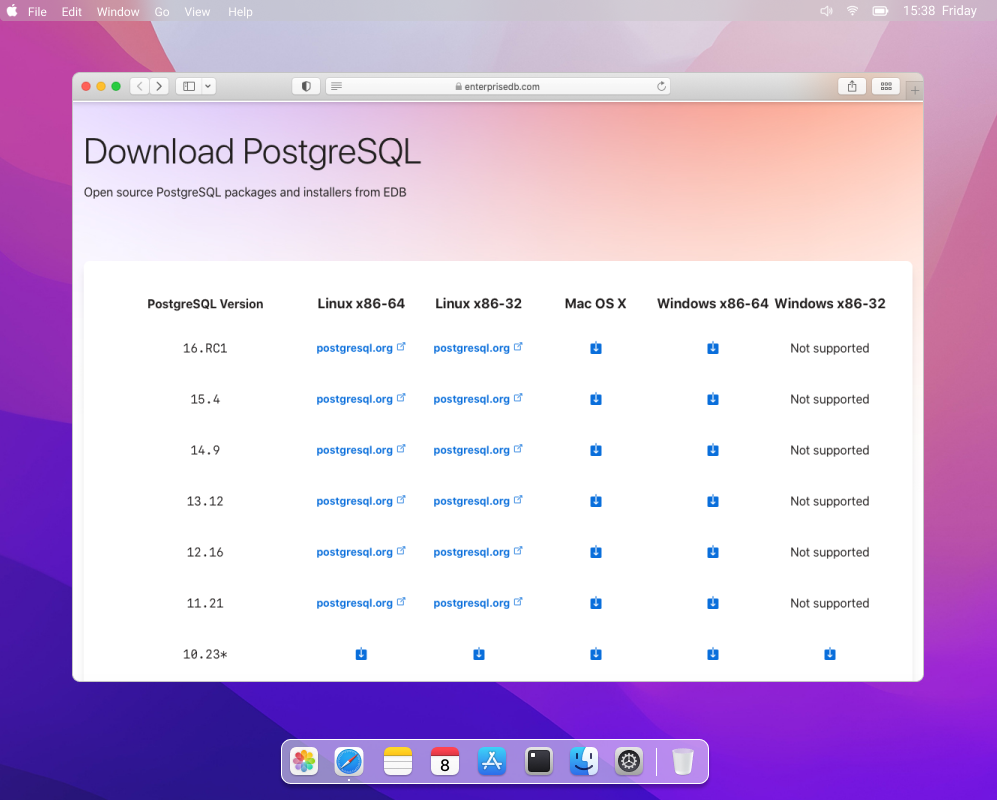
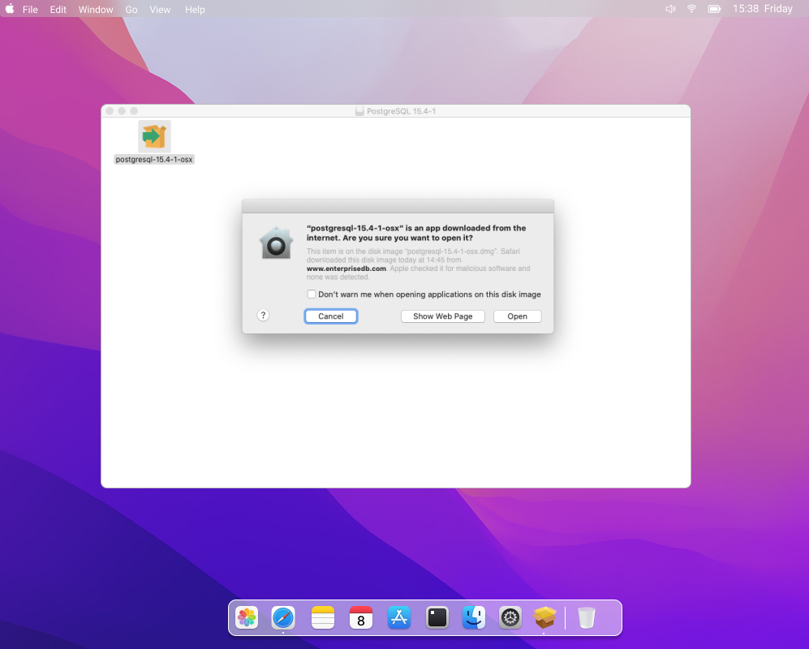
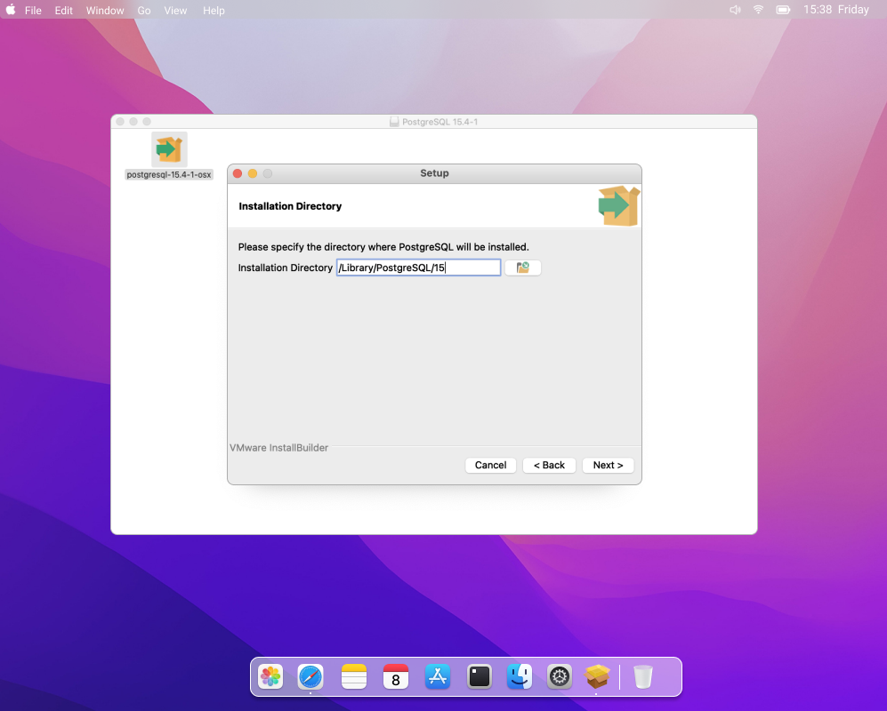
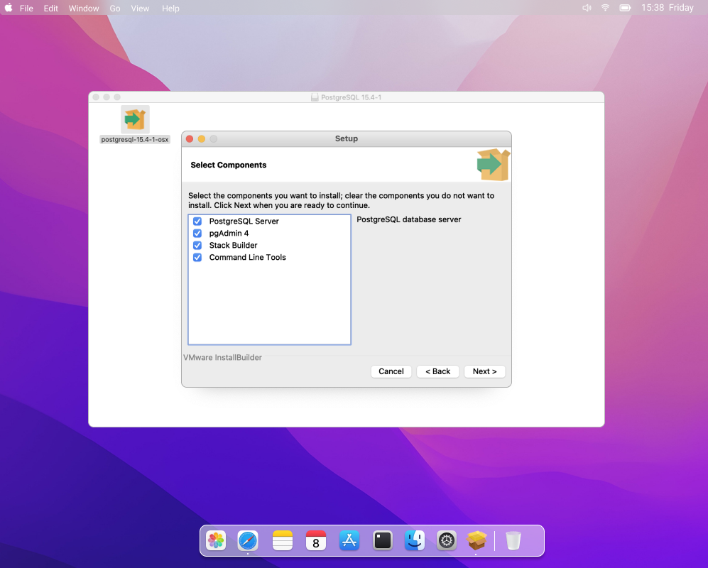
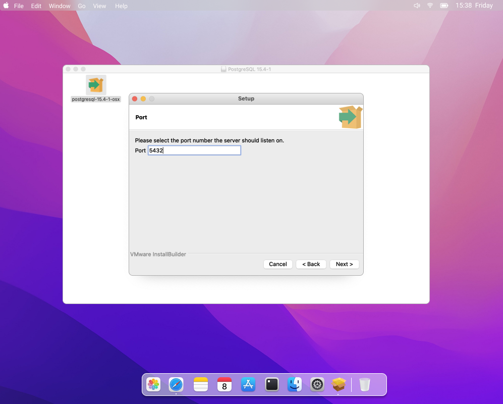
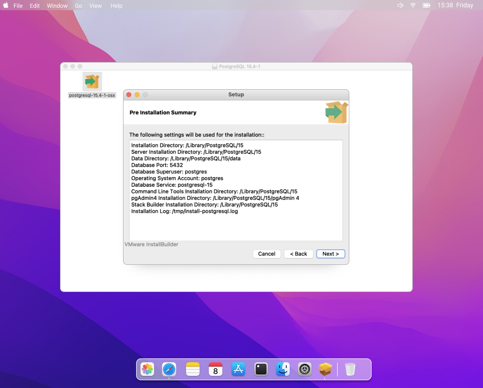
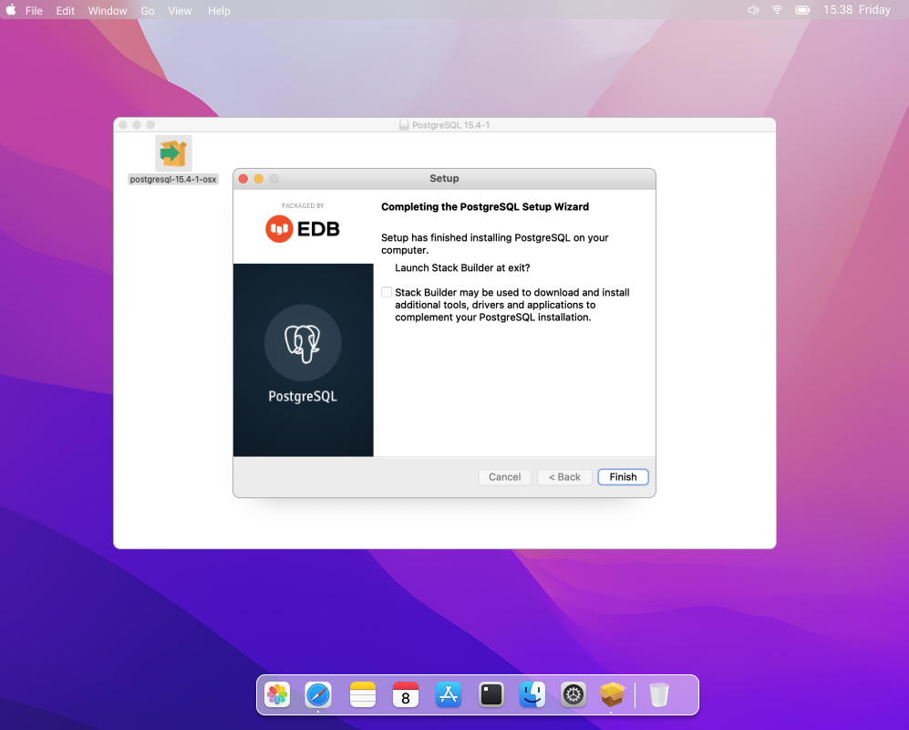

# Cài đặt PostgreSQL 

## 1. Tải xuống trình cài đặt PostgreSQL cho Macbook

Ta chọn phiên bản phù hợp với hệ điều hành máy mà muốn sử dụng 

## 2. Mở tệp .dmg đã tải xuống vào trình hướng dẫn cài đặt

Mở tệp .dmg đã tải xuống. Nhấp đúp vào tệp trình cài đặt bên trong và nhấp vào Mở . Nếu máy Mac của bạn được khóa bằng mật khẩu, bạn sẽ được yêu cầu nhập mật khẩu 

Trình hướng dẫn sẽ mở ra. Nhấp vào Tiếp theo .

## 3.  Chỉ định thư mục cài đặt

Hãy chỉ định thư mục trên máy Mac của bạn nơi bạn muốn cài đặt PostgreSQL và nhấn Tiếp theo .

## 4. Chọn các thành phần cần thiết 

Giữ nguyên các thành phần bạn muốn cài đặt đã được chọn và nhấn Tiếp theo .

## 5.Chỉ định thư mục dữ liệu 

Hãy chỉ định thư mục nơi dữ liệu của bạn sẽ được lưu trữ và nhấn Tiếp theo .
## 6.Cung cấp mật khẩu 

Hãy cung cấp mật khẩu mới cho người dùng quản trị cơ sở dữ liệu. Sau này, bạn sẽ sử dụng mật khẩu này để kết nối với PostgreSQL. Sau đó, nhấp vào Tiếp theo .

## 7.Chỉ định cổng 

Nếu cần, hãy thay đổi cổng mặc định rồi nhấn Tiếp theo .

## 8.Chọn ngôn ngữ/ vùng miền 

Chọn ngôn ngữ/vùng miền mà PostgreSQL sẽ sử dụng. Theo mặc định, nó sẽ sử dụng ngôn ngữ/vùng miền của hệ điều hành hiện tại của bạn.

## 9.Xem lại bản tóm tắt trước khi cài đặt 

Xem lại bản tóm tắt trước khi cài đặt. Sau khi chắc chắn mọi thứ đều chính xác, hãy nhấp vào Tiếp theo .

## 10.Khởi chạy quá trình cài đặt 

Giờ đây PostgreSQL đã sẵn sàng để cài đặt. Nhấn Tiếp theo .

## 11.Để quá trình cài đặt tiếp tục 

 

Hãy cho người lắp đặt vài phút để hoàn tất việc lắp đặt.

## 12. Hoàn tất cài đặt

Sau khi quá trình cài đặt hoàn tất, bạn sẽ nhận được thông báo. Nếu trước đó bạn đã chọn cài đặt Stack Builder , bạn sẽ được nhắc khởi chạy nó khi thoát. Sau đó, nhấp vào Finish để thoát khỏi trình hướng dẫn. Bạn đã cài đặt PostgreSQL trên máy Mac của mình.
