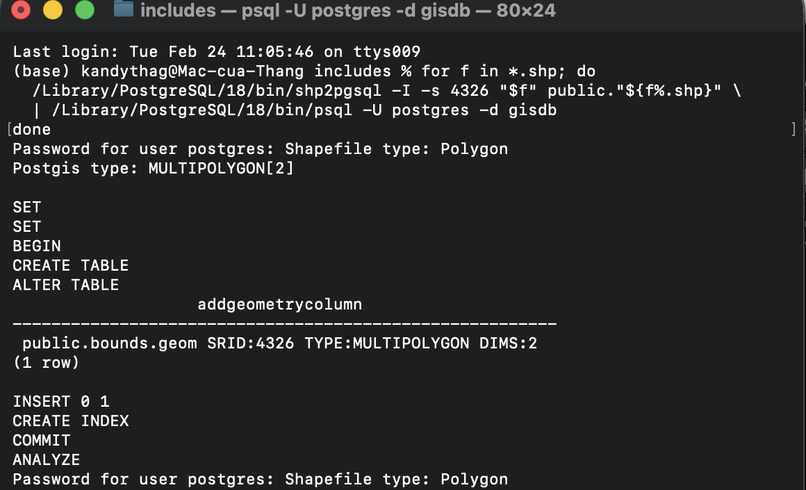
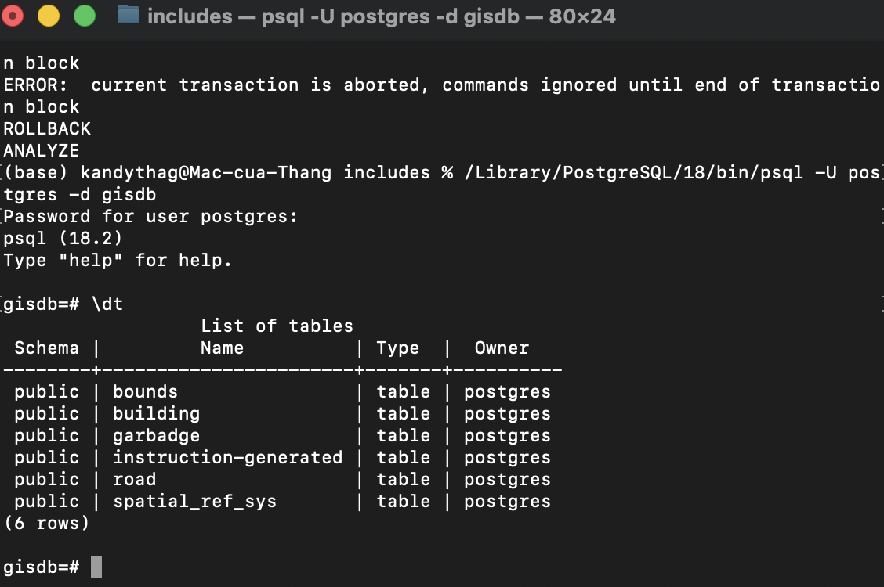
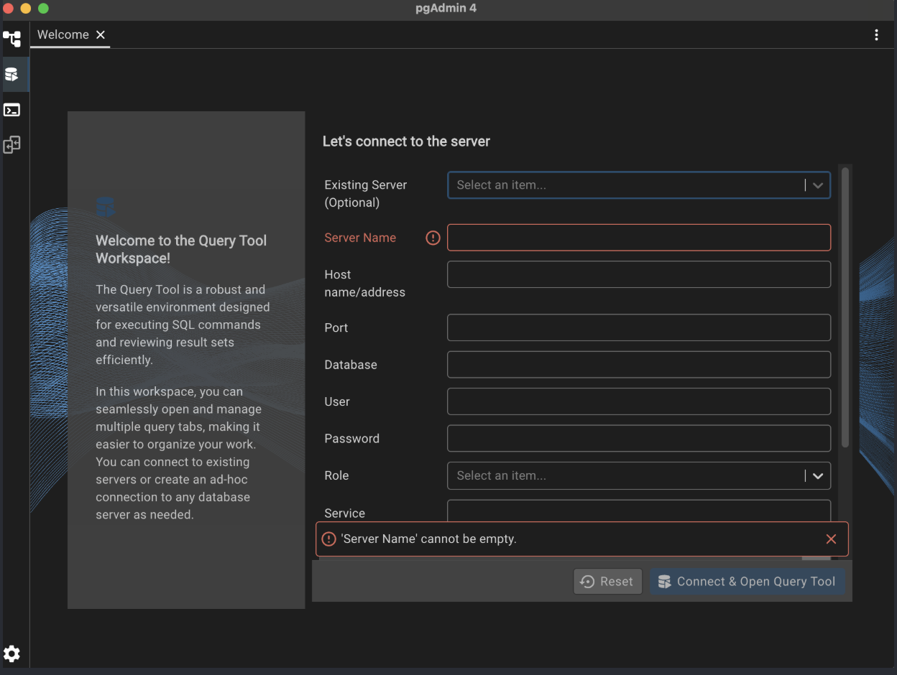
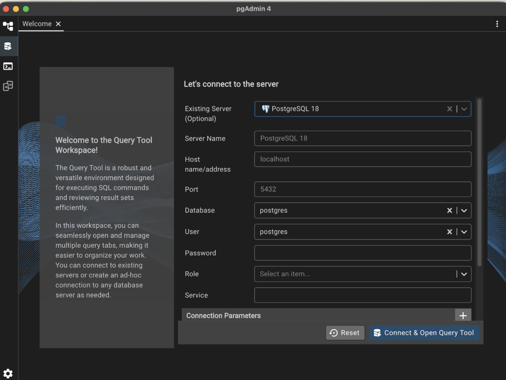
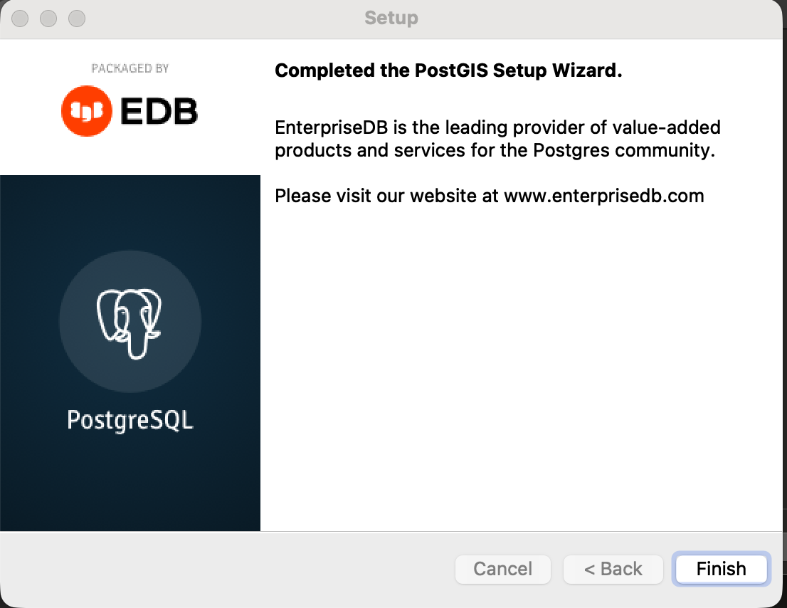
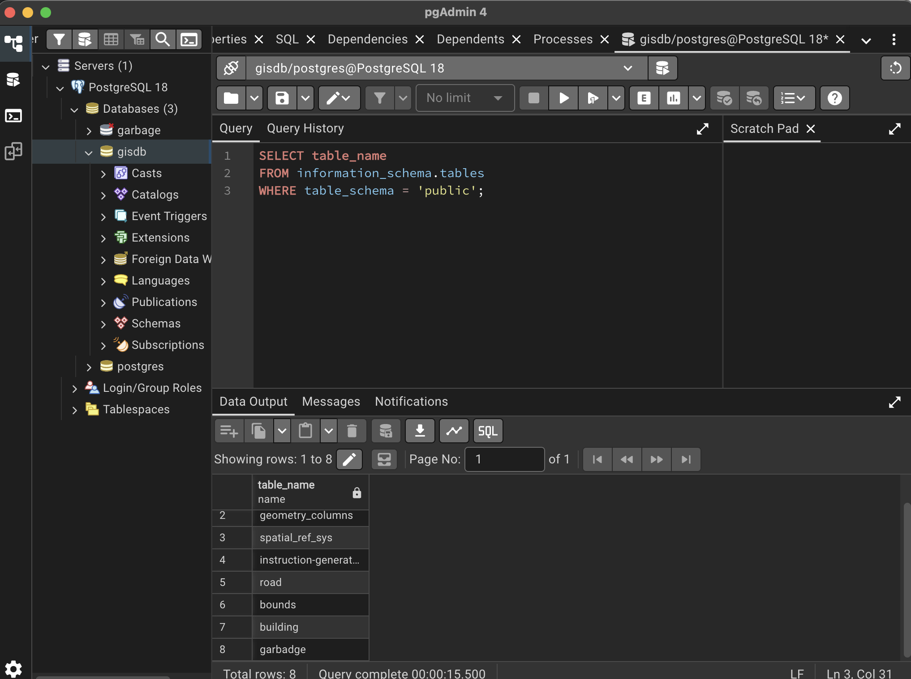

# Import dữ liệu 

## Sử dụng termial trên máy Mac 

Mở termial và thêm câu lệnh để import dữ liệu 

```py
for f in *.shp; do
  /Library/PostgreSQL/18/bin/shp2pgsql -I -s 4326 "$f" public."${f%.shp}" \
  | /Library/PostgreSQL/18/bin/psql -U postgres -d gisdb
done
```

Lệnh này sẽ:
- Lấy tất cả file .shp
- Tạo bảng tương ứng trong database
- Import toàn bộ .dbf đi kèm
- Tạo spatial index




Sau đó xử dụng lệnh 
```py
/Library/PostgreSQL/18/bin/psql -U postgres -d gisdb
```
Lệnh này chuyển về ```gisdb``` và show bảng dữ liệu ```\dt```



## Sử dụng application pgAdmin4 kiểm tra dữ liệu đã đến đúng thư mục chưa

Ở Existing Server chọn "PostgreSQL 18" 



Nhập password khi tạo ứng dụng cho việc bảo vệ dữ liệu 



Cài đặt PostGIS thông qua "Stak Builder" 



Chạy query kiểm tra cơ sở dữ liệu trên pgAdmin 4

 